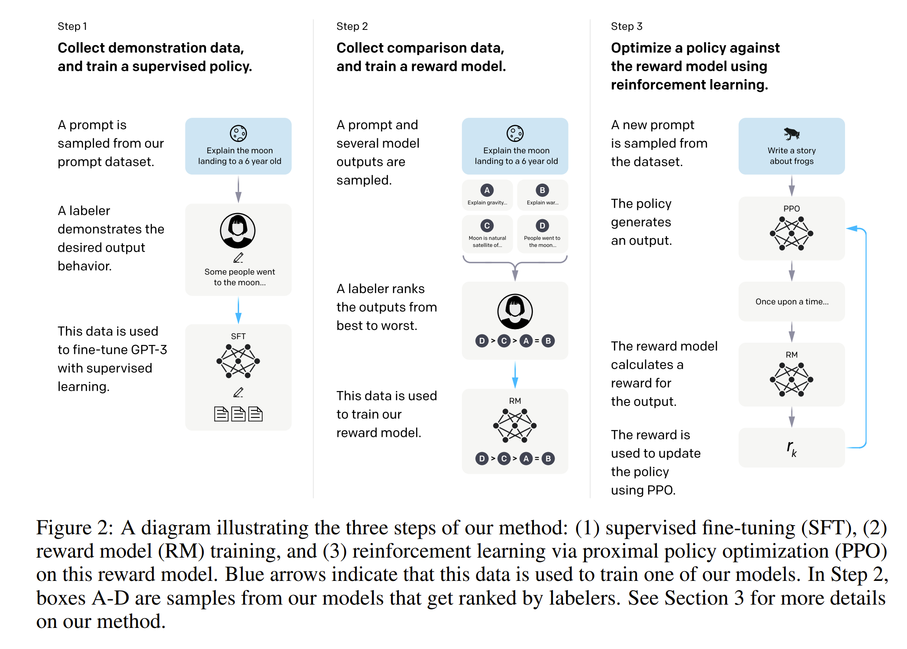

# 10/7 AI ラボ　 ChatGPT の原理について

## 経緯

過去の案件相談において、OpenAI が開発した ChatGPT のような 精度改善可能な仕組みを自社にも導入できないかという問い合わせがあった。（難易度高め）

じゃあどうすればニーズにこたえられるのか自問し、ChatGPT の原理や改善手法について理解を深めればため応用できるのではないかと考えた。

今回は、ChatGPT の基本的な原理について解説します。
[OpenAI サイトより](https://openai.com/ja-JP/index/instruction-following/)

## 目次

- 前置き
- ChatGPT の原理について
- まとめ

---

### 前置き

案件の話

- [KDDI DAC](https://biz.kddi.com/beconnected/feature/2024/240306/)
- [ソフトバンクの動き](https://news.yahoo.co.jp/articles/18aa8b8a3405c6670544546714a390c0175431e0)

---

### ChatGPT について

- ChatGPT は、OpenAI が 2022 年 11 月 30 日にサービスとしてローンチした大規模な言語モデルであり、自然言語処理のタスクにおいて高い性能を得ている。
- ChatGPT は、**GPT（Generative Pre-trained Transformer）アーキテクチャ**に基づいており、膨大なテキストデータを学習して、人間のような文章生成や対話が可能。

- **GPT（Generative Pre-trained Transformer）**とは?

  - GPT は、OpenAI が開発した自然言語処理のための大規模な言語モデル。
  - GPT は、Transformer アーキテクチャに基づいており、自己注意機構を利用して文脈を理解し、文章を生成します。**※あくまで確率的なモデルであり次に出力する単語を予測している。** （条件付き確率）

  [Attention 論文](https://arxiv.org/pdf/1706.03762)
  

---

### ChatGPT の原理について

- **ChatGPT の学習プロセス**

前提として**InstructGPT**の学習の流れを GPT-3 に適用したものが ChatGPT。

- [InstructGPT](https://openai.com/ja-JP/index/instruction-following/) 論文より

- **step1: SFT（Supervised Fine-Tuning）教師あり学習**
  - プロンプトの入力例に対し、人間が正解例を作成し、教師あり学習の形式で GPT-3 の Fine-tuning を実施。
  - 実は裏側では GPT-3 には教師なし学習が既になされていることに注意。
- **step2: Reward Model の学習**
  - 人間が複数の応答例を評価し、ランキング付けを行い、これを基に報酬モデル（Reward Model）を学習させる。
- **step3: PPO を用いた強化学習 (Reinforcement Learning)**

  - 人間のフィードバックを利用して、モデルの出力をさらに改善。
  - ポリシー勾配法などの強化学習アルゴリズムを用いて、モデルがより良い応答を生成するように学習。
  - 補足
    - PPO（Proximal Policy Optimization）は、強化学習におけるポリシー最適化手法の一つで、モデルのパラメータを更新する際に、大きな変動を避けるためのクリッピング手法を導入している。

- 目的関数
  

  - 第１項
    - 報酬モデルの出力を最大化する役割を果たす。
  - 第２項
    KL ペナルティ（Kullback-Leibler Divergence）で、現在のポリシーと元のポリシーの乖離を抑制する役割を果たす。
  - 第３項
    pretrained model からの出力を参照し、元のモデルから大きく逸脱しないようにするためのペナルティ項。

---

### まとめ

- ChatGPT は人間の評価を組み込んで学習されているため、従来の言語モデルよりも自然で適切な応答を生成できる。

⇒ ChatGPT に聞けば一般的な答えは誰でも入手可能であるが、最新の技術の知見やインターネットに公開されていない情報を入手することには向いていない。

- ハルシネーションはなくならない。なぜなら言語モデルは確率モデルであるため。

- 技術課題として、ChatGPT 含め LLM の精度をいかに向上させるか、探索する必要がある。
  - LoRA（PEFT ライブラリの活用）
  - QLoRA
  - Prompt Tuning

※RAG（Retrieval Augmented Generation）は検索タスクで使用されるもの。

---

### 参考文献

- [InstructGPT 論文](https://arxiv.org/abs/2203.02155)
- [Attention is All You Need 論文](https://arxiv.org/pdf/1706.03762)
- [PPO 論文](https://arxiv.org/abs/1707.06347)
- [Reward Model 論文](https://arxiv.org/pdf/2009.01325)
- [松尾研究所 経済産業省向け説明資料](https://www.meti.go.jp/shingikai/mono_info_service/digital_jinzai/pdf/008_05_00.pdf)
- [LLM のファインチューニングと RAG](https://www.ohmsha.co.jp/book/9784274231957/)
